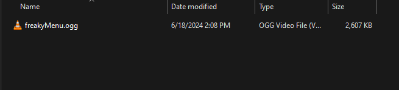
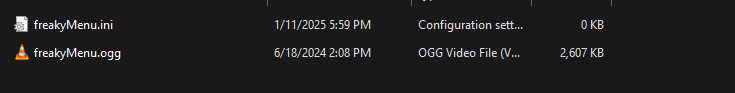
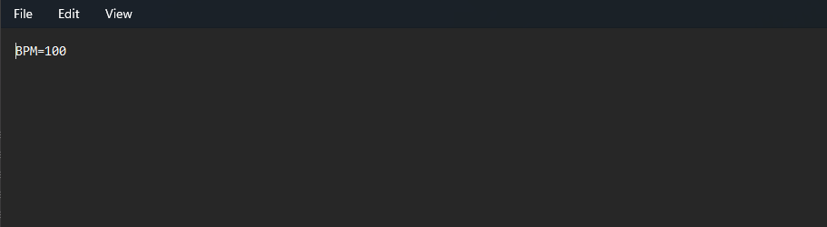

# Tips & Tricks
## <h2 id="inserting" sidebar="Sprite Layering">Add sprite/object behind or above another</h2>

You may have a sprite that you might wanna put above or below another sprite. This is possible using the `insert(position:Int, object:T)` function.
```haxe
var blueSolid = new FunkinSprite(200, 200).makeSolid(200, 200, FlxColor.RED);
add(blueSolid);

var redSolid = new FunkinSprite(250, 250).makeSolid(100, 100, FlxColor.RED);
insert(members.indexOf(blueSolid)+1, redSolid);
/*
This would add the red solid right above the blue solid. If we want it below the blue
solid, we would use the insert function, like so.
*/
insert(members.indexOf(blueSolid), redSolid);

```
## <h2 id="set-window-name" sidebar="Window Name">Set Window Name</h2>

Instead of the window name being "Friday Night Funkin' - Codename Engine", you can change it to be whatever you want.

Start by editing or making a script named `global` in `your mod/data`.

Now, you can add these lines.

```haxe
import funkin.backend.utils.WindowUtils; //Put this at the top of the file.

WindowUtils.winTitle = 'Your Mod Name';
/*
This line could either be added outside of a function, or you could put it in
function new()
*/
```

Using this over `window.title` is much better, since it won't reset on state changes.

## <h2 id="sprite-preload" sidebar="Preloading Sprites">Preloading Sprites</h2>

It's literally just one line.

```haxe 
graphicCache.cache(Paths.image('your image'));
```

## <h2 id="add-mod-menu" sidebar="Mod switch menu in custom state">Adding the mod switch menu to a ModState.</h2>


If you want to add this mod switch menu to your custom mod state, it is relatively simple.

```haxe
import funkin.menus.ModSwitchMenu; //Import the menu.

if (controls.SWITCHMOD) //Or any sort of event you want this to happen
{
    openSubState(new ModSwitchMenu());
    persistentUpdate = false;
    persistentDraw = true;
}

//You can also do the same thing with the editor picker.
import funkin.editors.EditorPicker;

if (FlxG.keys.justPressed.SEVEN) //Or any sort of event you want this to happen
{
    openSubState(new EditorPicker());
    persistentUpdate = false;
    persistentDraw = true;
}

```

## <h2 id="custom-bpm" sidebar="BPM in audio file">Set BPM for an audio file without code.</h2>

You may want an audio file to have a BPM assigned to it, like the menu music. 

To do this, navigate to the folder that has the audio you want to assign a BPM to (ex: freakyMenu.ogg).


Now, create an .ini file with the same name as the audio file you want to assign a BPM to, and open the file and add `BPM=your bpm value`.



Please note that you must use `CoolUtil.playMusic()` for the .ini file to have any effect.
